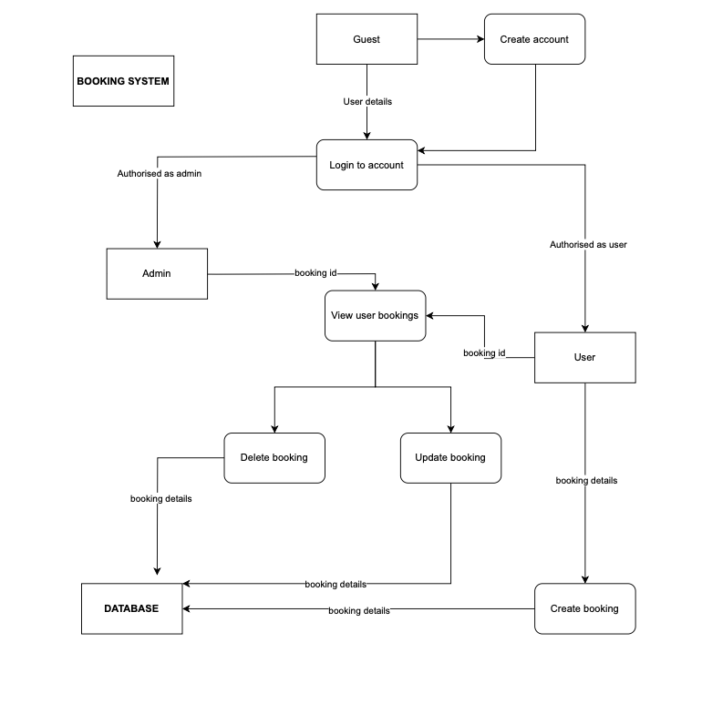

# Jessica Liong & Luke Wheldale T3A2-Part A

Pawtel: MERN Full-Stack App Assignment

## Purpose

Pawtel is a comprehensive full-stack application designed to streamline the process of booking accommodations for pets in a specialised animal hotels. This user-friendly platform aims to provide a seamless experience for scheduling and managing stays for their beloved animals, simplifying the often cumbersome process of finding suitable lodgings of leaving pets with friends, family or close neighbours. We have one more solution to pawrents, you can now leave it all to the professionals for their care, accomodations, and bookings!

The interface allows pet owners to easily browse options, check availability and secure bookings, while also facilitating the provision of detailed pet information. The platform promotes transparency through comprehensive descriptions and images, fostering trust and confidence in the care their pets receive. With efficient communication features and a streamlined admin dashboard for hotel management, Pawtel not only addresses the concerns of pet owners but also enhances operational efficiency for the hotel staff. This responsive and accessible application provides a tailored and trustworthy solution, elevating the experience for both pet owners and animal hotel operators in the pet boarding industry.

The app will have the following main features:

1. A dashboard for pet owners to book accommodations, fill out information about their pets, accomodation and dietary requirements.

2. A dashboard for hotel admins to login and manage bookings, user accounts and accommodation bookings.

## Target Audience

Owners of furbabies requiring accomodation and the associated animal hotels.

## Functionality / Features

## User Stories

### User Stories for Pet Owners (Pawrents):

1. **As a pet owner,**

    - **Persona:** Lucy, a busy professional with a dog named Max.
    - **What:** I want to easily browse through available accommodations for Max on the Pawtel app.
    - **Why:** This helps me quickly find a suitable place for Max without spending too much time.

2. **As a pet owner,**

    - **Persona:** Tim, a cat lover with two cats, Whiskers and Mittens.
    - **What:** I want to provide detailed information about Whiskers and Mittens, including their dietary requirements, to ensure their comfort during the stay.
    - **Why:** This ensures that the hotel staff can take proper care of my cats, making their stay stress-free.

3. **As a pet owner,**

    - **Persona:** Jane, a frequent traveler with a kitten named Sunny.
    - **What:** I want to receive real-time updates and images of Sunny during his stay in the animal hotel.
    - **Why:** This feature gives me peace of mind and keeps me connected with Sunny, making me more confident about leaving him in the hotel's care.

4. **As a pet owner,**
    - **Persona:** Michael, a new pet owner with a puppy named Luna.
    - **What:** I want a straightforward booking process that includes choosing dates, selecting suitable accommodations, and completing the payment.
    - **Why:** This helps me easily navigate the app and ensures a hassle-free experience when booking a stay for Luna.

### User Stories for Hotel Admins:

1. **As a hotel admin,**

    - **Persona:** Monica, responsible for managing accommodations at an animal hotel.
    - **What:** I want a dashboard/way to view and manage incoming bookings.
    - **Why:** This allows me to efficiently organise and allocate accommodations, ensuring a smooth workflow for the hotel.

2. **As a hotel admin,**

    - **Persona:** Geoff, a customer service representative for the animal hotel.
    - **What:** I want the ability to view detailed information about pets and their specific needs.
    - **Why:** This enables me to provide personalised care and address any special requirements, enhancing the overall service quality.

3. **As a hotel admin,**

    - **Persona:** Blake, responsible for user account management.
    - **What:** I want the capability to manage user accounts, including account creation, password resets, and account deactivation.
    - **Why:** This ensures proper control and security over user accounts, contributing to a trustworthy platform.

## Sprint Planning

## Workflow

## Dataflow Diagram

Dataflow diagram for the Pawtel booking process:

## Application Architecture Diagram

## Wireframes

## Tech stack:
