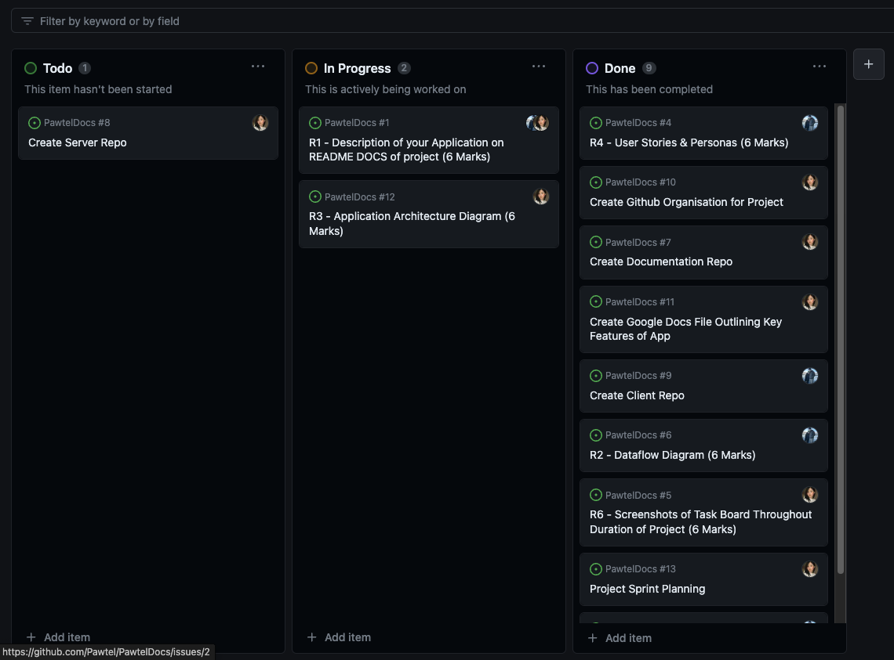
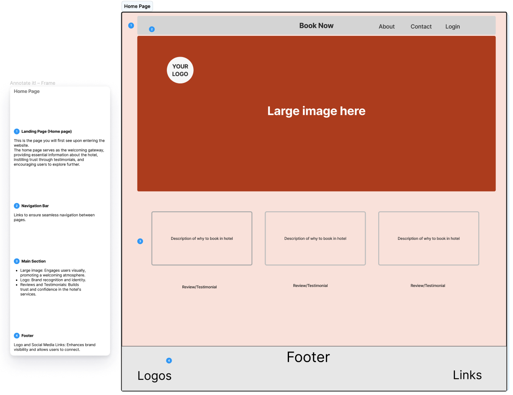
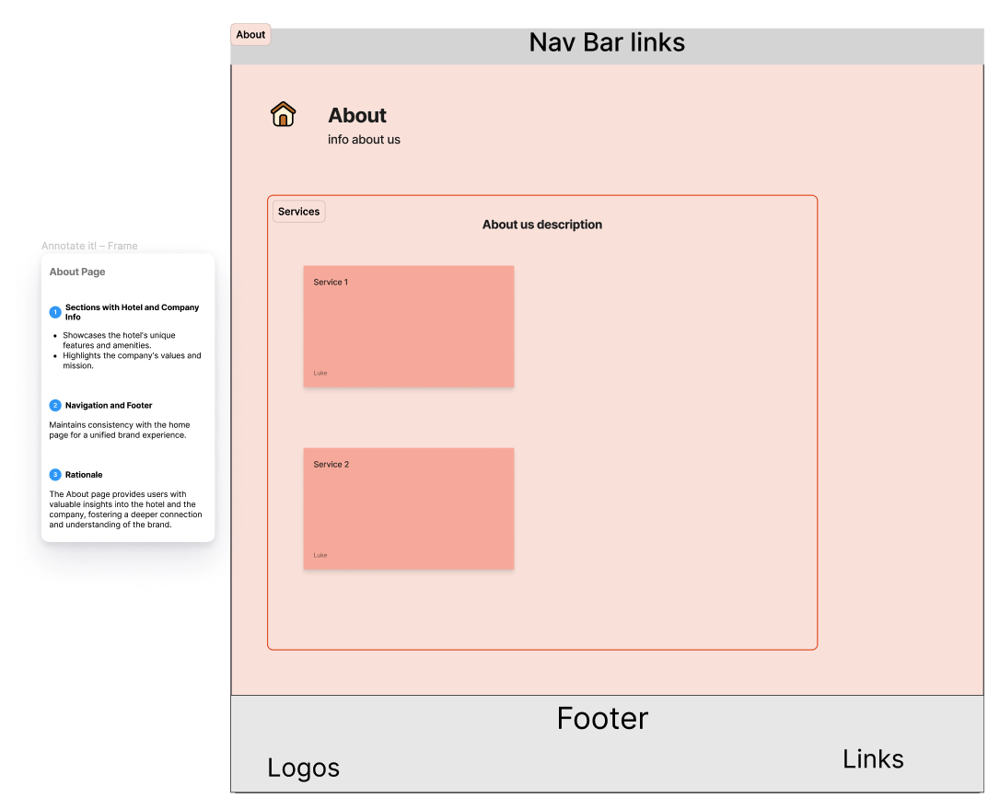
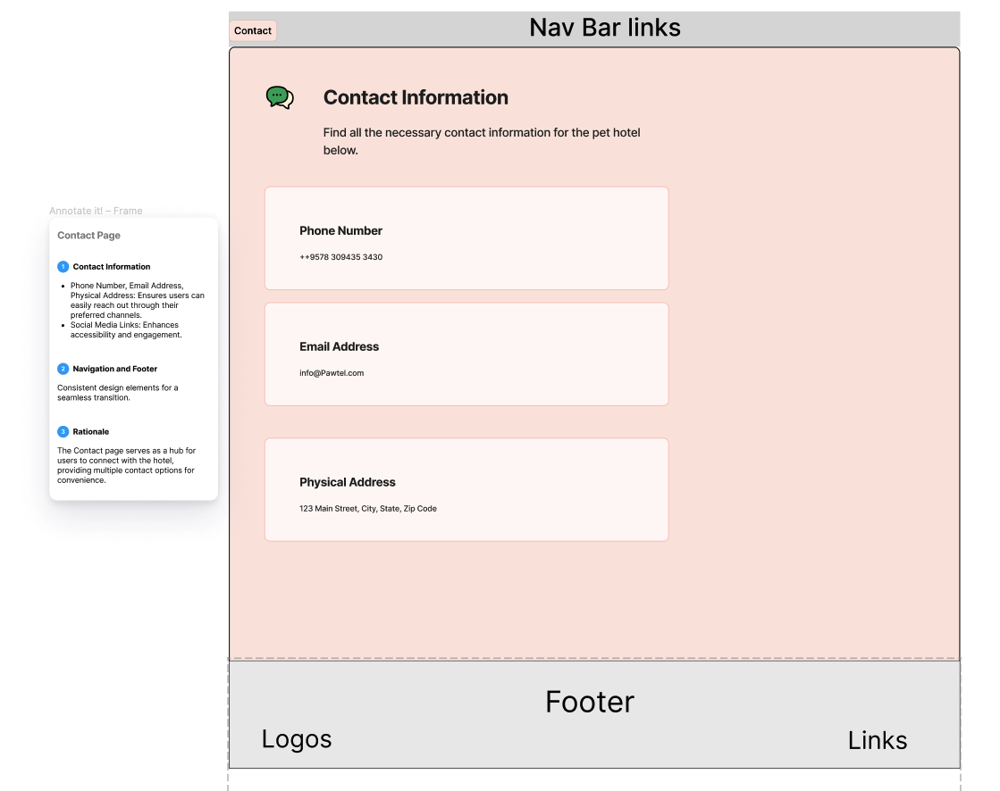
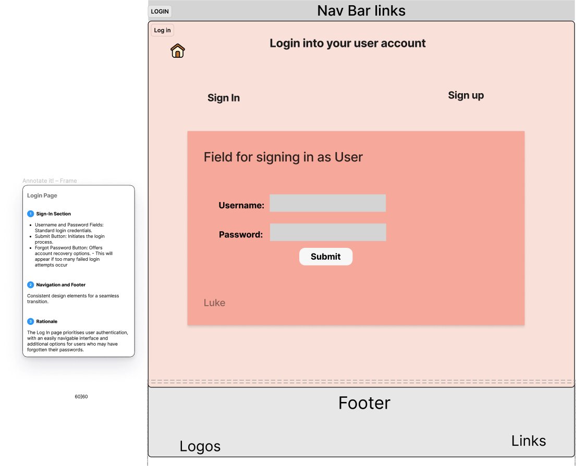
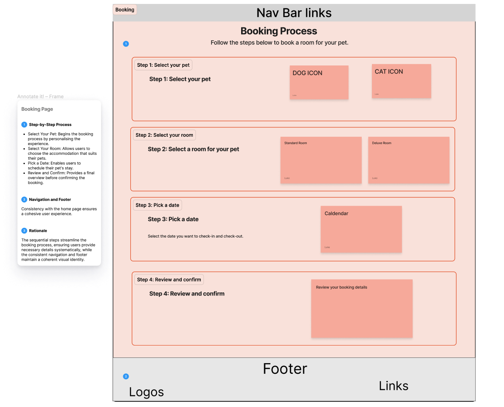

# Jessica Liong & Luke Wheldale T3A2-Part A

Pawtel: MERN Full-Stack App Assignment

### Links:

-   [Wireframes](https://www.figma.com/file/n85eBLBMLiT896YcBo5TIf/Pawtel-Basic-Wireframe?type=design&node-id=0%3A1&mode=design&t=1FGMzm9wyB74M4KK-1)

-   [Dataflow Diagram](https://drive.google.com/file/d/1v7GH27Z7NaY5bu_eUweMEEYiAXQYtE4n/view?usp=sharing)

-   [Application Architecture Diagram](https://drive.google.com/file/d/146RkoudhIIPqNRsoYjDDlnqTg4_FvBED/view?usp=sharing)

-   [Github Projects](https://github.com/orgs/Pawtel/projects/1/views/1)

## Purpose

Pawtel is a comprehensive full-stack application designed to streamline the process of booking accommodations for pets in a specialised animal hotels. This user-friendly platform aims to provide a seamless experience for scheduling and managing stays for their beloved animals, simplifying the often cumbersome process of finding suitable lodgings of leaving pets with friends, family or close neighbours. We have one more solution to pawrents, you can now leave it all to the professionals for their care, accomodations, and bookings!

The interface allows pet owners to easily browse options, check availability and secure bookings, while also facilitating the provision of detailed pet information. The platform promotes transparency through comprehensive descriptions and images, fostering trust and confidence in the care their pets receive. With efficient communication features and a streamlined admin dashboard for hotel management, Pawtel not only addresses the concerns of pet owners but also enhances operational efficiency for the hotel staff. This responsive and accessible application provides a tailored and trustworthy solution, elevating the experience for both pet owners and animal hotel operators in the pet boarding industry.

The app will have the following main features:

1. A dashboard for pet owners to book accommodations, fill out information about their pets, accomodation and dietary requirements.

2. A dashboard for hotel admins to login and manage bookings, user accounts and accommodation bookings.

## Target Audience

Owners of furbabies requiring accomodation and the associated animal hotels.

## Functionality / Features

The app will have different sets of features for two groups of interest.

All Users: The app will ask all users to complete authentication steps before access of site features can be displayed in their account dashboard. All users can login through the same login page regardless of whether an admin staff/ hotel staff is logging in and the same functionality of the app will allow them to logout of their accounts. New accounts for administrators will be a different process to hotel staff and customers and must be created by Data Manager to ensure security of account.

**Pet Owners**

When authorised upon login will have access tp a dashboard that contains information about their bookings

-   View their individual information
-   Previous booking history
-   Create a new booking
-   Update own details & pet details
-   Update own booking
-   Delete own booking

**Hotel Staff**

When authorised as hotel staff by admin and logged into their account, hotel staff will be able to see information regarding all bookings in the database.

-   Total number of bookings per date
-   View daily earnings
-   View customer's pet information
-   View customer information

## User Stories

### Personas

**Pet Owner Personas:**

1. **Lucy - The Busy Professional with Max:**

    - **Job Title & Industry:** Marketing Manager in a tech company.
    - **Demographics:** 32-year-old female, resides in a city, annual income $80,000.
    - **Background:** Lucy, a dedicated professional, values efficiency in her personal life. Max, her energetic dog, is her loyal companion.
    - **Professional Goals:** Balancing work and personal life, finding convenient solutions.
    - **Challenges:** Limited time for pet-related tasks.
    - **Motivators:** Streamlined pet care services.
    - **Sources of Information:** Prefers quick access to information via mobile apps.

2. **Tim - The Cat Lover with Whiskers and Mittens:**

    - **Job Title & Industry:** Graphic Designer in a creative agency.
    - **Demographics:** 28-year-old male, lives in a suburban area, annual income $60,000.
    - **Background:** Tim, an artistic soul, finds joy in the company of his cats, Whiskers and Mittens.
    - **Professional Goals:** Expressing creativity through design.
    - **Challenges:** Ensuring the comfort of his cats during their stay.
    - **Motivators:** Knowing his cats are cared for.
    - **Sources of Information:** Prefers detailed information, perhaps through email updates.

3. **Jane - The Frequent Traveler with Sunny:**

    - **Job Title & Industry:** Flight Attendant for a major airline.
    - **Demographics:** 35-year-old female, lives in a busy urban area, annual income $90,000.
    - **Background:** Jane, a jet-setter, often travels and values staying connected with her kitten, Sunny.
    - **Professional Goals:** Achieving work-life balance during travels.
    - **Challenges:** Staying connected with her pet during trips.
    - **Motivators:** Real-time updates for peace of mind.
    - **Sources of Information:** Mobile notifications and email updates.

4. **Michael - The New Pet Owner with Luna:**
    - **Job Title & Industry:** Software Developer in a startup.
    - **Demographics:** 27-year-old male, resides in an apartment, annual income $70,000.
    - **Background:** Michael, a tech enthusiast, recently adopted Luna, a playful puppy.
    - **Professional Goals:** Advancing in the tech industry.
    - **Challenges:** Navigating the pet care process as a new owner.
    - **Motivators:** Hassle-free booking experiences.
    - **Sources of Information:** Prefers intuitive and straightforward app interfaces.

**Hotel Admin Personas:**

1. **Monica - Responsible for Managing Accommodations:**

    - **Job Title & Industry:** Operations Manager in a high-end pet hotel.
    - **Demographics:** 40-year-old female, experienced in hospitality, annual income $100,000.
    - **Background:** Monica is dedicated to ensuring the smooth operation of accommodations at the hotel.
    - **Professional Goals:** Efficiently managing hotel operations.
    - **Challenges:** Balancing accommodation allocation during peak times.
    - **Motivators:** A dashboard for organized booking management.
    - **Sources of Information:** Prefers real-time data and analytics.

2. **Geoff - Customer Service Representative:**

    - **Job Title & Industry:** Customer Service Representative in the pet hospitality sector.
    - **Demographics:** 30-year-old male, has a background in customer service, annual income $55,000.
    - **Background:** Geoff is passionate about providing top-notch service to pet owners.
    - **Professional Goals:** Enhancing customer satisfaction through personalized service.
    - **Challenges:** Addressing specific pet needs effectively.
    - **Motivators:** Access to detailed pet information for personalized care.
    - **Sources of Information:** Detailed customer profiles and direct communication.

3. **Blake - Responsible for User Account Management:**
    - **Job Title & Industry:** Data Manager in the pet accommodation sector.
    - **Demographics:** 35-year-old male, experienced in data management, annual income $80,000.
    - **Background:** Blake is committed to ensuring the security and control of user accounts.
    - **Professional Goals:** Implementing robust user account management processes.
    - **Challenges:** Maintaining security while managing user accounts.
    - **Motivators:** Effective user account control for a trustworthy platform.
    - **Sources of Information:** Adheres to industry best practices for data security.

### User Stories for Pet Owners (Pawrents):

1. **As a pet owner,**

    - **Persona:** Lucy, a busy professional with a dog named Max.
    - **What:** I want to easily browse through available accommodations for Max on the Pawtel app.
    - **Why:** This helps me quickly find a suitable place for Max without spending too much time.

2. **As a pet owner,**

    - **Persona:** Tim, a cat lover with two cats, Whiskers and Mittens.
    - **What:** I want to provide detailed information about Whiskers and Mittens, including their dietary requirements, to ensure their comfort during the stay.
    - **Why:** This ensures that the hotel staff can take proper care of my cats, making their stay stress-free.

3. **As a pet owner,**

    - **Persona:** Jane, a frequent traveler with a kitten named Sunny.
    - **What:** I want to receive real-time updates and images of Sunny during his stay in the animal hotel.
    - **Why:** This feature gives me peace of mind and keeps me connected with Sunny, making me more confident about leaving him in the hotel's care.

4. **As a pet owner,**
    - **Persona:** Michael, a new pet owner with a puppy named Luna.
    - **What:** I want a straightforward booking process that includes choosing dates, selecting suitable accommodations, and completing the payment.
    - **Why:** This helps me easily navigate the app and ensures a hassle-free experience when booking a stay for Luna.

### User Stories for Hotel Admins:

1. **As a hotel admin,**

    - **Persona:** Monica, responsible for managing accommodations at an animal hotel.
    - **What:** I want a dashboard/way to view and manage incoming bookings.
    - **Why:** This allows me to efficiently organise and allocate accommodations, ensuring a smooth workflow for the hotel.

2. **As a hotel admin,**

    - **Persona:** Geoff, a customer service representative for the animal hotel.
    - **What:** I want the ability to view detailed information about pets and their specific needs.
    - **Why:** This enables me to provide personalised care and address any special requirements, enhancing the overall service quality.

3. **As a hotel admin,**

    - **Persona:** Blake, responsible for user account management.
    - **What:** I want the capability to manage user accounts, including account creation, password resets, and account deactivation.
    - **Why:** This ensures proper control and security over user accounts, contributing to a trustworthy platform.

## Sprint Planning

At the start of the project, we have decided to create a git projects board with tasks required to complete the planning part A of the project and forsee tasks to complete in the coming days. Each task was put as a card on github projects and a list of tasks to complete was written on the cards. We assigned each member according to their capabilities and skills to share the workload and complete planning.

Each of us are responsible for completing set tasks on github projets and we will continue onto adding more tasks as we forsee them to be completed or solved.

We will be working remotely and alone, communicating mostly via discord chat and discord calls.

We have decided to build our apps within 5 sprints:

1. Set up front and back end frameworks
2. Create login functionality
3. Create & Read functionality for parent and hotel staff
4. Create Delete and Update functionalities
5. Daily bookings and total balance on staff dashboard
6. Further styling of application to enhance look

## Screenshots of Github Projects Board

The screenshots of our github projects board can be found in the github_project_screenshots folder located in this repo. You can also view the Github Project Board live and in its final state using the following [link](https://github.com/orgs/Pawtel/projects/1/views/1)

This is the look of the initial board upon creating cards and listing tasks to complete the action cards.

and an insight to the checklist of a card:

We assigned ourselves tasks (In Progress) and as we completed them we checked them off (Done).

## Workflow

We will be working using the Github organisation across 3 repos: Pawtel docs, Pawtel Client side, consisting of the front-end and react components, and finally the back-end Server side.

The version control we will utilise is the forking workflow, where we feature different branches off sections we're working on within our local development branch and make pull requests to merge into the main repo's development branch.
Each pull request will be checked by the other individual within the group upon approval and merging into the main branch.
This will allow for the project to check each other's work before merging into the main branch, allow the project to maintain an agile working flow and allow addition of further features within the appliation for future improvements.

We will incorporate CI/CD (continuous integration and continous delivery/deployment) by setting up a staging pipeline utilising with Heroku and Netlify. Pull requests which have been approved will be viewable in the staging version of the app and merges onto the main branch will be deployed onto production. This will allow us to see the altered versions live and test the application within different stages automatically by developers and hotel staff for futher feedback.

Testing of the application will be completed on client and server side. We will perform automated unit tests for the server side using TDD method before pushing to the main code. The deployed server and client side will be manually tested by this team and automated integration tested with cypress once they are linked. Manual and automated tests will be recorded on the production version of the application for documentation.

## Dataflow Diagram

[Dataflow Diagram Link](https://drive.google.com/file/d/1v7GH27Z7NaY5bu_eUweMEEYiAXQYtE4n/view?usp=sharing)

Dataflow diagram for the Pawtel booking process:

## Application Architecture Diagram

[Application Architecture Diagram Link](https://drive.google.com/file/d/146RkoudhIIPqNRsoYjDDlnqTg4_FvBED/view?usp=sharing)

Application Architecture Diagram for Pawtel website:

## Wireframes

[Figma Link](https://www.figma.com/file/n85eBLBMLiT896YcBo5TIf/Pawtel-Basic-Wireframe?type=design&node-id=0%3A1&mode=design&t=1FGMzm9wyB74M4KK-1)

Homepage: 

About page: 

Contact page: 

Login page: 

Booking page: 

## Tech stack:

Front-End: HTML5, CSS3, ReactJS,

Back-end: Node, ExpressJS

Database: MongoDB, Mongoose

Project Management Tools: Github Projects, Discord

Utilities: Figma, Draw.io,

Code Editor: VScode

Source Control: Git, Github
